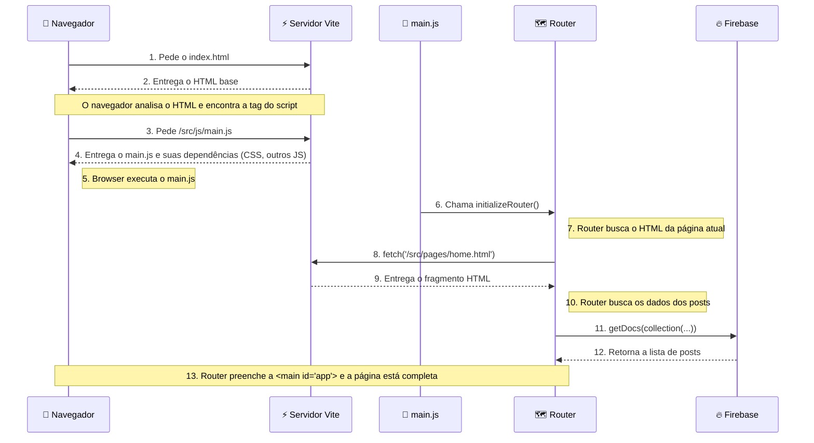

# vagner.pages - Meu CMS Pessoal

Bem-vindo ao repositório do **vagner.pages**, um projeto de blog e Sistema de Gerenciamento de Conteúdo (CMS) construído do zero com HTML, CSS e JavaScript puro (módulos ES6+), e potencializado pelo ecossistema do Firebase e ferramentas de desenvolvimento modernas.

Este `README` serve como uma documentação central do projeto, explicando sua estrutura, as boas práticas aplicadas e como executá-lo.

## 🚀 Como Rodar o Projeto Localmente

1.  Clone este repositório.
2.  Certifique-se de ter o [Node.js](https://nodejs.org/) (versão LTS) instalado.
3.  Crie um arquivo `.env` na raiz do projeto, usando o `.env.example` como modelo para preencher suas chaves do Firebase.
4.  Abra o terminal na pasta do projeto e instale as dependências:
    ```bash
    npm install
    ```
5.  Inicie o servidor de desenvolvimento do Vite:
    ```bash
    npm run dev
    ```
6.  Abra a URL `http://localhost:5173` (ou a que for indicada no seu terminal) no navegador.

## 📂 Estrutura do Projeto

A estrutura do projeto separa claramente as configurações do código-fonte da aplicação (`src`).

* `.env` - Armazena variáveis de ambiente e segredos (local, não versionado).
* `.env.example` - Arquivo de exemplo para as variáveis de ambiente.
* `.gitignore` - Define quais arquivos o Git deve ignorar.
* `index.html` - O ponto de entrada principal (a "casca") da nossa SPA.
* `package.json` - Define as dependências e scripts do projeto.
* `firebase.json` / `firestore.rules` - Configurações do Firebase.
* `public/` - Contém assets estáticos que são servidos diretamente, como o `favicon.svg`.
* `src/` - **Contém todo o código-fonte da aplicação.**
    * `assets/` - Recursos como o sprite de ícones SVG.
    * `components/` - Fragmentos de HTML reutilizáveis (`header.html`, `footer.html`).
    * `css/` - Arquivos de estilo (`style.css`).
    * `js/` - Todos os módulos JavaScript da aplicação.
    * `pages/` - Fragmentos de HTML para cada "página" da SPA.

## 🏗️ Arquitetura e Linha de Tempo de Carregamento

A aplicação segue o padrão SPA (Single Page Application), orquestrado pelo Vite. O diagrama de sequência abaixo ilustra o processo de carregamento inicial da página Home.



## ✨ Funcionalidades

* **Autenticação Segura:** Login com o Google através do Firebase Authentication.
* **Banco de Dados na Nuvem:** Todos os posts são armazenados e lidos do Firestore.
* **Arquitetura SPA:** Navegação rápida e fluida sem recarregar a página.
* **CRUD Completo:** Crie, Leia, Atualize e Exclua posts em uma área administrativa protegida.
* **Editor Markdown:** Escreva posts usando um editor moderno (EasyMDE) que salva em Markdown.
* **Renderização Segura:** O conteúdo é convertido de Markdown para HTML e sanitizado para prevenir ataques de XSS.
* **Publicação Profissional:** Deploy feito através do Firebase Hosting.

## 📘 Guia de Boas Práticas Aplicadas

Este projeto foi construído seguindo uma série de boas práticas do mercado para garantir um código limpo, seguro e de fácil manutenção.

* **Centralização do Código-Fonte (`src`):** Todo o código da aplicação reside na pasta `/src`, separando-o dos arquivos de configuração. ([Vite: A Pasta `src`](https://vitejs.dev/guide/#scaffolding-your-first-vite-project))
* **Gerenciamento de Segredos (`.env`):** Chaves de API são armazenadas em um arquivo `.env` local (ignorado pelo Git) e lidas pelo Vite, prevenindo a exposição de dados sensíveis. ([Vite: Variáveis de Ambiente e Modos](https://vitejs.dev/guide/env-and-mode.html))
* **HTML Semântico:** Utilizamos tags como `<header>`, `<main>`, `<footer>`, etc., para Acessibilidade e SEO. ([MDN: Elementos semânticos](https://developer.mozilla.org/pt-BR/docs/Glossary/Semantics#semantics_in_html))
* **CSS Moderno (Design Tokens):** Usamos variáveis CSS (`:root`) para centralizar as decisões de design, facilitando a consistência e a criação de temas. ([MDN: Usando variáveis CSS](https://developer.mozilla.org/pt-BR/docs/Web/CSS/Using_CSS_custom_properties))
* **JavaScript Modular (ESM):** Usamos `import`/`export` para criar um código desacoplado e com dependências claras. ([MDN: Módulos JavaScript](https://developer.mozilla.org/pt-BR/docs/Web/JavaScript/Guide/Modules))
* **Arquitetura SPA (*Single Page Application*):** A aplicação carrega uma única vez e a navegação é gerenciada via JavaScript, para uma experiência de usuário mais rápida. ([MDN: Single-page application](https://developer.mozilla.org/pt-BR/docs/Glossary/SPA))
* **Segurança no Front-End (Sanitização):** Todo conteúdo gerado pelo usuário é sanitizado com **DOMPurify** para prevenir ataques de **XSS (*Cross-Site Scripting*)**. ([OWASP: Prevenção de XSS](https://cheatsheetseries.owasp.org/cheatsheets/Cross_Site_Scripting_Prevention_Cheat_Sheet.html))
* **Gerenciamento de Dependências (NPM):** Todas as bibliotecas externas são gerenciadas pelo NPM e listadas no `package.json`. ([npm Docs: About npm](https://docs.npmjs.com/about-npm))

## 🎯 Próximos Passos

O plano é continuar evoluindo o projeto com foco em design e funcionalidades avançadas.

-   [x] ~~Migrar do `LocalStorage` para o **Firebase**.~~
-   [x] ~~Publicar o site com **Firebase Hosting**.~~
-   [x] ~~Implementar um **Design System** (Material Design 3) para uma UI moderna.~~
-   [ ] Implementar **Taxonomia** (Categorias e Tags).
-   [ ] Configurar um **domínio personalizado**.
-   [ ] Adicionar funcionalidades com **Inteligência Artificial** usando a API do Gemini.